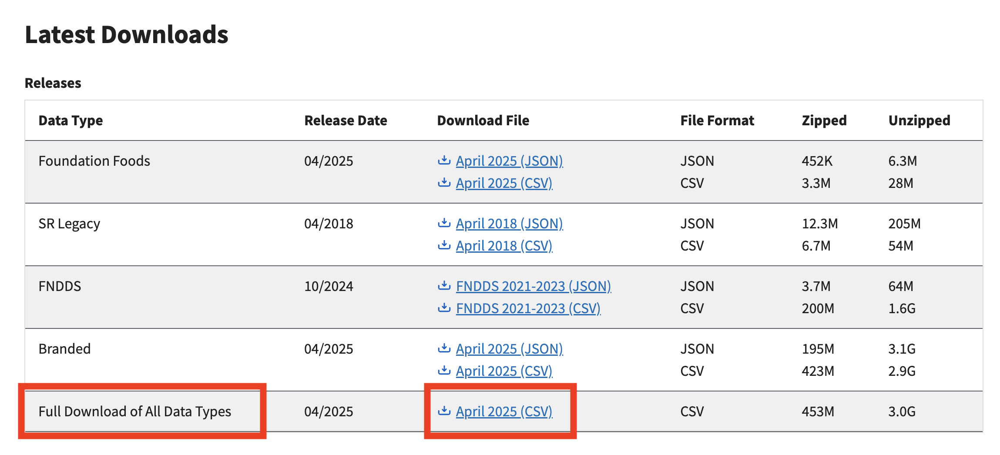

# 🏋️‍♂️ Health and Fitness Tracker

## 📋 Project Summary

The **Health and Fitness Tracker** is a comprehensive database system designed to help users monitor their daily food intake and exercise routines. This system allows individuals to log and manage personal health data, including current and goal weight, dietary habits, and structured workout plans.

Built to support web-based data integration—such as nutritional data from the USDA Food Data Central—the system combines reliable external sources with user-provided information to enable a personalized fitness tracking experience. Users can log meals, track macronutrients, and follow customized workout routines tailored to their fitness goals.

### 🔍 Key Features:
- **User Profiles**: Store login credentials and essential metrics like weight, height, and fitness goals.
- **Diet Tracking**: Daily food diaries linked to comprehensive nutrition data, including calories, protein, fats, and carbs.
- **Exercise Plans**: Structured workout programs composed of exercises grouped by sets, reps, muscle group, and type (e.g., lifting or cardio).
- **Progress Monitoring**: Track weight changes over time and adjust plans accordingly.
- **Relational Database Design**: A normalized schema linking users, diet logs, food items, exercises, and workout plans efficiently.

This system forms the backend foundation for a potential web or mobile application to empower users to take control of their health journey through consistent and informed tracking.

- Connects Flask to a MySQL database
- Parses and cleans USDA food CSVs
- Imports over 1.8 million food items
- Has a working /users route that pulls user data from MySQL

## 🚀 Project Setup Instructions

### Prerequisites

Make sure you have the following installed:

- [Python 3.8+](https://www.python.org/downloads/)
- [pip](https://pip.pypa.io/en/stable/installation/)
- [MySQL Server](https://dev.mysql.com/downloads/mysql/)
- [VS Code](https://code.visualstudio.com/) *(optional but recommended)*

---

### 🛠 Setup Steps

#### **1. Get the project files**

**Option A: ZIP Download**
- If you received a ZIP (e.g. from BBLearn), extract the contents.
- Open the folder in VS Code or another editor.

**Option B: Clone from GitHub**
```bash
git clone https://github.com/thd46/macroandcalo.git
cd macroandcalo
```
---

#### **2. Download USDA Food Data**

TSome of the USDA dataset is too large to include in the repo. You’ll need to download it manually:

1. Visit: https://fdc.nal.usda.gov/download-datasets.html  
2. Download the dataset "Full Download of All Data Types":

> 

3. Extract and place the following files into 'FoodItems/USDA Food Data/' :

Files to move:
- `food.csv` -> ~ 1.77 gb
- `food_nutrient.csv` -> ~ 215 mb

After completing the above, your 'FoodItems/USDA Food Data/' should contain the following:
- `food.csv`
- `nutrient.csv`
- `food_portion.csv`
- `food_nutrient.csv`

---

#### **3. Create and activate a virtual environment**

- **Windows:**
```bash
python -m venv venv
venv\Scripts\activate
```

- **Mac/Linux:**
```bash
python3 -m venv venv
source venv/bin/activate
```

#### **4. Install requirements**

pip install -r requirements.txt

#### **5. Set up the MySQL database**

mysql -u root -p < CREATE_DATABASE.sql

#### **6. Edit db_config.py with your MySQL password**

#### **7. Run the scraper to populate all the necessary files:**

python FoodItems/USDA-scraper.py

#### **8. Run import_to_db.py - this will import our Exercise and Food Data into the DB we just created:**

- **Windows:**
```bash
python import_to_db.py
```

- **Mac/Linux:**
```bash
python3 import_to_db.py
```

#### **9. Start the App:**

- **Windows:**
```bash
python app.py
```

- **Mac/Linux:**
```bash
python3 app.py
```

**NOTE THE FOLLOWING** 
- You only need to run the import once (it’s slow)
- cleanFoodItems.csv is already prepared after running the scraper
- Don’t forget to activate your venv every time
- If you are running into issues with importing certain modules in the virtual environment (typically pandas or numpy), you can run import_to_db.py on your local
environment with those modules installed. Just make sure to start up the virtual environment when running the application

**Sources** 
- The food data sourced from the USDA website: https://fdc.nal.usda.gov/download-datasets.html 
- The exercise data was AI generated since reps and sets can vary from source to source considering research in the field of fitness
has conflicting beliefs on the appropriate ranges. We AI generated the csv (exercises_full_variations.csv).